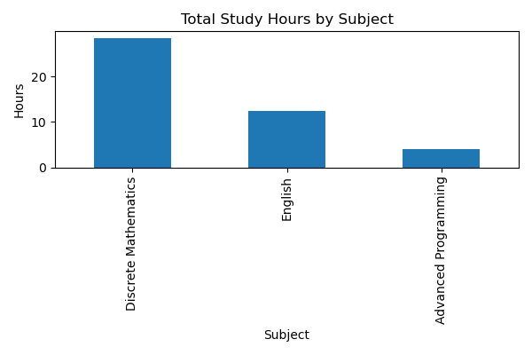
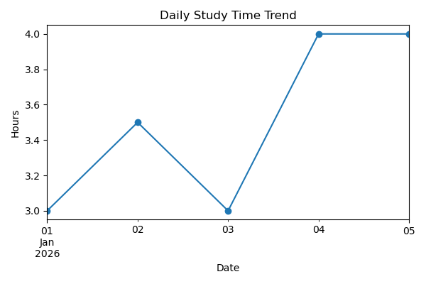

# Study Log Analysis

This project is a small personal data analysis project based on my daily study records during exam preparation.
It focuses on descriptive analysis and consistency metrics rather than predictive modeling.

The project serves as a lightweight and reproducible example of basic data collection, aggregation, and visualization using Python.

## Motivation

During long-term self-study, I often felt busy but could not clearly explain how my study time was distributed across different subjects.

Rather than relying on subjective impressions, I decided to record my study activities and analyze them using data.

This project represents my first practical attempt to apply Python for data analysis and structured self-reflection.

## Dataset

The dataset is manually collected and stored in `Data/study_log.csv`.

Each record contains:

- `date`: study date
- `subject`: subject studied
- `hours`: time spent (in hours)
- `note`: short personal notes

Because the data is self-recorded, the dataset is small and personal.
No external preprocessing or augmentation was applied.

## Analysis

The analysis is implemented in a Jupyter notebook and focuses on:

- Loading and inspecting the dataset using pandas
- Aggregating study time by subject and by date
- Visualizing study time distribution and trends using matplotlib

The emphasis is on clarity, reproducibility, and interpretability rather than complex modeling.

## Results

The analysis reveals clear differences in time allocation across subjects and highlights short-term consistency and interruptions in study behavior.

These results help make abstract study habits visible and measurable.

### Subject breakdown

### Daily trend

## How to run

### Quickstart (CLI)

    pip install -r requirements.txt
    python -m src.main

Outputs will be saved to `figures/`.

### Notebook (optional)

    jupyter notebook Notebooks/study_analysis.ipynb

Recommended: use a virtual environment (venv) to avoid dependency conflicts.